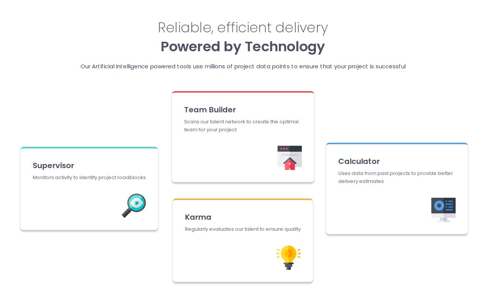

# Frontend Mentor - Four card feature section solution

This is a solution to the [Four card feature section challenge on Frontend Mentor](https://www.frontendmentor.io/challenges/four-card-feature-section-weK1eFYK). Frontend Mentor challenges help you improve your coding skills by building realistic projects. 

## Table of contents

- [Overview](#overview)
  - [The challenge](#the-challenge)
  - [Screenshot](#screenshot)
  - [Links](#links)
- [My process](#my-process)
  - [Built with](#built-with)
  - [What I learned](#what-i-learned)
  - [Continued development](#continued-development)
  - [Useful resources](#useful-resources)
- [Author](#author)

## Overview

### The challenge

Users should be able to:

- View the optimal layout for the site depending on their device's screen size

### Screenshot



### Links

- Solution URL: [Add solution URL here](https://your-solution-url.com)
- Live Site URL: [Add live site URL here](https://your-live-site-url.com)

## My process

### Built with

- Semantic HTML5 markup
- CSS custom properties
- Flexbox
- CSS Grid
- Mobile-first workflow

### What I learned

This project was a great opportunity to practice CSS Grid layout, specifically using `grid-template-areas`. It allowed for an intuitive way to rearrange the cards for different screen sizes.

```css
.components-container {
    display: grid;
    grid-template: 1fr 1fr 1fr 1fr / 1fr ;
    grid-template-areas:
        "supervisor"
        "teambuilder"
        "karma"
        "calculator";
}
```

I also learned how to use CSS custom properties to maintain consistent spacing and colors throughout the project.

### Continued development

In future projects, I would like to explore more complex CSS animations to add some interactivity to the cards when they are hovered over.

### Useful resources

- [MDN Web Docs - CSS Grid Layout](https://developer.mozilla.org/en-US/docs/Web/CSS/CSS_Grid_Layout) - This helped me understand the `grid-template-areas` property.

## Author

- Website - [Your Name](https://www.your-site.com)
- Frontend Mentor - [@yourusername](https://www.frontendmentor.io/profile/yourusername)
